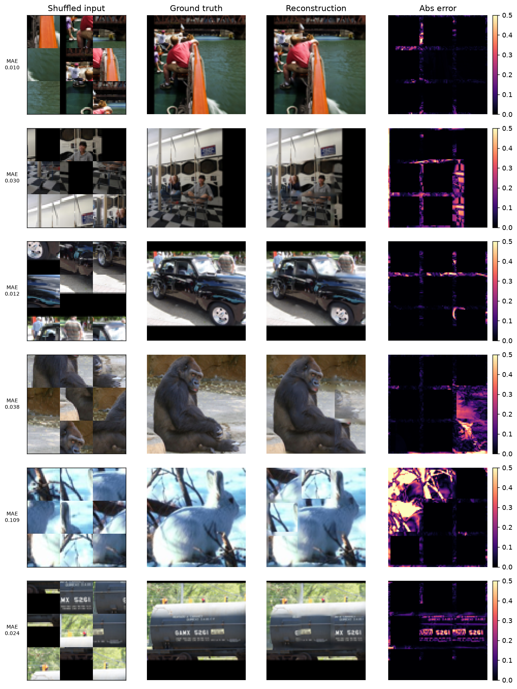
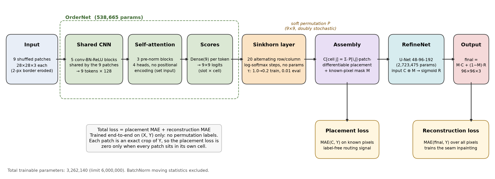
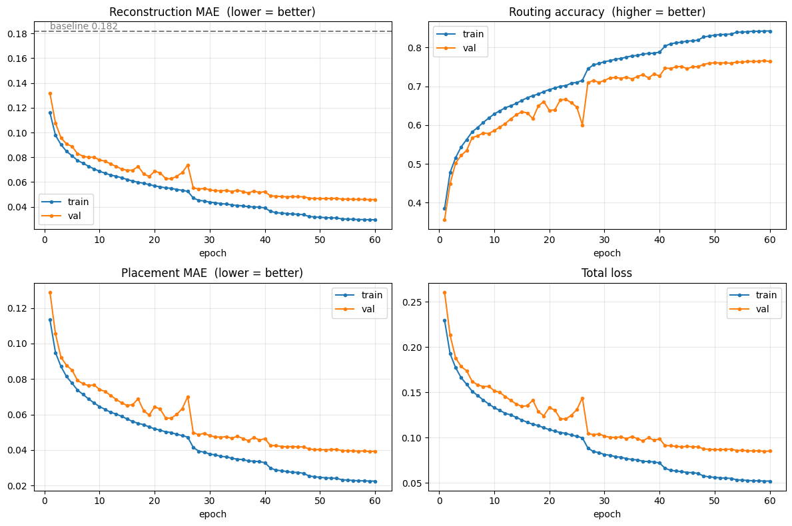

# Jigsaw puzzle reconstruction on STL-10

Rebuild a 96×96 image from 9 shuffled, border-eroded patches with one end-to-end neural network: test MAE **0.043** against a 0.182 mean-patch baseline, with 3.26 M parameters and no permutation labels.



[](LICENSE)
[](https://colab.research.google.com/github/matinmonshizadeh/jigsaw-puzzle-reconstruction/blob/main/notebooks/report.ipynb)
[-blue)](https://github.com/matinmonshizadeh/jigsaw-puzzle-reconstruction/releases/download/v1.0/jigsaw.weights.h5)

## Overview

Exam project for the Deep Learning course of the MSc in Artificial Intelligence, University of Bologna, 2026.
The task: each STL-10 image is cut into a 3×3 grid, every cell is centre-cropped from 32×32 to 28×28 (a 2-pixel border disappears, so patches never share an edge), the 9 patches are shuffled, and the model must output the original 96×96 image; the metric is the mean absolute error (MAE) on 10,000 held-out images.
The constraints: neural networks only (no classical puzzle solver), no pretrained weights, fewer than 6 M trainable parameters, weights downloadable, runs on Colab. The full assignment text is in [docs/assignment.md](docs/assignment.md).

## Method



**OrderNet.** A small CNN (5 conv-BN-ReLU blocks, 0.14 M parameters) embeds each 28×28 patch into a 128-d token; the same weights are applied to all 9 patches. Three pre-norm self-attention blocks (4 heads, no positional encoding, so the input order carries no information) let the patches compare with each other, and a final dense layer scores every (patch, cell) pair, giving a 9×9 matrix.

**Sinkhorn layer and differentiable assembly.** The score matrix goes through 20 alternating row and column log-softmax normalisations (Sinkhorn normalisation, Mena et al. 2018). This is a parameter-free normalisation layer inside the network, in the same sense as softmax, to which it reduces for a single iteration; it is not a discrete solver, and nothing is post-processed. Its output P is doubly stochastic, and the canvas is assembled as a linear combination, cell j = Σᵢ P[i, j] · patchᵢ, so gradients flow back into OrderNet. Where OrderNet is confident, P is a permutation for all practical purposes (entries above 0.999); where two patches are equally plausible, the cell becomes a convex blend of both.

**RefineNet.** A 3-level U-Net (48-96-192 channels, 2.72 M parameters) receives the canvas plus a mask of the known pixels and predicts the full image. The known pixels are copied straight from the canvas, so the U-Net only has to inpaint the 2-pixel seams (23% of the pixels).

**Loss, and why no labels are needed.** Total loss = placement MAE + reconstruction MAE. The placement term compares the canvas with the target on the known pixels only; because each patch is an exact crop of the target, it is zero only when every patch sits in its own cell, so the routing is learned from the images alone. The reconstruction term is the competition metric itself, computed on the final image.

**Temperature annealing.** The Sinkhorn temperature is lowered linearly from 1.0 to 0.2 over the 60 epochs, so the assignment starts soft (stable gradients) and sharpens gradually; evaluation uses 0.01.

## Results

Seeded evaluation on the 10,000 test images with the released weights (`python evaluate.py`):

| Metric | Mean-patch baseline | Ours |
|---|---|---|
| Test MAE (mean over images) | 0.1824 | **0.0428** |
| Std of per-image MAE | 0.0561 | 0.0494 |
| Routing accuracy (patch in its exact cell) | - | 78.6% |
| Puzzles fully solved (all 9 patches) | - | 45.9% |
| Trainable parameters | 0 | 3,262,140 |



The error maps above show that a correctly solved puzzle leaves only a faint grid of error along the inpainted seams (MAE around 0.01-0.03). Bright blocks are misrouted patches, and half-bright, ghosted cells are blends where the network hedged between two similar patches, which costs less MAE than committing to the wrong one.

## Reproducibility

```bash
pip install -r requirements.txt            # pinned versions used for the numbers above (Python 3.10+)
curl -L -o weights/jigsaw.weights.h5 https://github.com/matinmonshizadeh/jigsaw-puzzle-reconstruction/releases/download/v1.0/jigsaw.weights.h5
python evaluate.py --weights weights/jigsaw.weights.h5       # prints the table, writes docs/error_maps.png
python train.py --epochs 60 --batch-size 64 --seed 0 --out runs/exp1
python evaluate.py --weights runs/exp1/jigsaw.weights.h5
```

The first run downloads STL-10 (2.6 GB) into `~/.keras/datasets`. Evaluation takes about 1 minute on a Colab T4 and about 8 minutes on a laptop CPU. Training takes about 2 hours on a T4 (114 s per epoch); on an A100 expect roughly 30-45 minutes (estimate, not measured). All hyper-parameters are in [configs/default.yaml](configs/default.yaml); `--seed 0` is the reported seed.

Evaluation is exactly reproducible: the permutations come from a per-batch seeded generator, and the same weights give identical numbers on CPU and GPU except for the last digit of the routing accuracy (78.58% vs 78.57%, one patch on a floating-point tie). Training is seeded (weight initialisation, data order, permutations) but not bit-reproducible on GPU because cuDNN picks non-deterministic convolution kernels; small run-to-run variation of the final MAE is expected.

## Model card

- **Data.** STL-10 unlabeled split (100,000 colour images, 96×96), split by index into 80,000 train / 10,000 validation / 10,000 test. No augmentation; pixel values scaled to [0, 1].
- **Training.** Adam, learning rate 1e-3 halved after 3 epochs without validation improvement, batch 64, 60 epochs, temperature annealed 1.0 to 0.2, early stopping (patience 8) on the validation MAE computed at the evaluation temperature, best checkpoint kept. One run on a Colab T4, about 2 hours. The released weights were saved after the run shown in the curves (its best validation MAE was 0.0458 at epoch 59); on the test split they score 0.0428.
- **Intended use.** Educational: a reference implementation of learning a permutation end-to-end with a Sinkhorn layer and a label-free placement loss. Not a general puzzle solver.
- **Limitations.** Fixed 3×3 grid, 28×28 crops of 32×32 cells, 96×96 natural images from the STL-10 distribution. Ambiguous patches are blended rather than decided; seams are inpainted, not recovered.

## Project structure

```
configs/default.yaml      every hyper-parameter (tau schedule, lr, w_place, n_iters, base, epochs)
docs/                     error_maps.png, training_curves.png, architecture.png/.svg, assignment.md
notebooks/report.ipynb    the course notebook (outputs of the curves and figures kept; first cell installs + downloads)
src/jigsaw/data.py        STL-10 download/loading, PatchGenerator, seeded generator, split, seeds
src/jigsaw/models.py      build_patch_encoder, build_ordernet, build_refinenet
src/jigsaw/trainer.py     JigsawTrainer (Sinkhorn, assembly, losses, metrics), TauAnneal, callbacks
src/jigsaw/evaluate.py    seeded test evaluation, routing accuracy from the true permutation, error maps
train.py / evaluate.py    command-line tools
weights/                  put jigsaw.weights.h5 here (GitHub Release v1.0; not tracked by git)
```

## Limitations and future work

- **Uniform patches.** Sky, walls and black letterbox bars give patches that are almost interchangeable. Swapping them costs almost no MAE but still counts as a routing error, and it is where most of the remaining 21% of misrouted patches come from. A pairwise edge-compatibility term could resolve these cases.
- **Seams.** The eroded 2-pixel borders are inpainted by the U-Net; on textured regions the seams stay faintly visible in the error maps. A perceptual or gradient loss on the seam pixels would sharpen them.
- **Hedging.** Exact ties in the Sinkhorn output produce blended cells. Gumbel-Sinkhorn noise during training or a hard assignment at test time (with a different metric) would give committed outputs.
- **No test-time augmentation.** Averaging over input permutations gains nothing because the network is permutation-equivariant; flips and rotations of the whole puzzle were not tried.
- **Scale.** Only the 3×3 STL-10 setting was studied; larger grids would need a larger attention module and more Sinkhorn iterations.

## License

MIT, see [LICENSE](LICENSE). STL-10 is provided by Stanford under its own terms.
